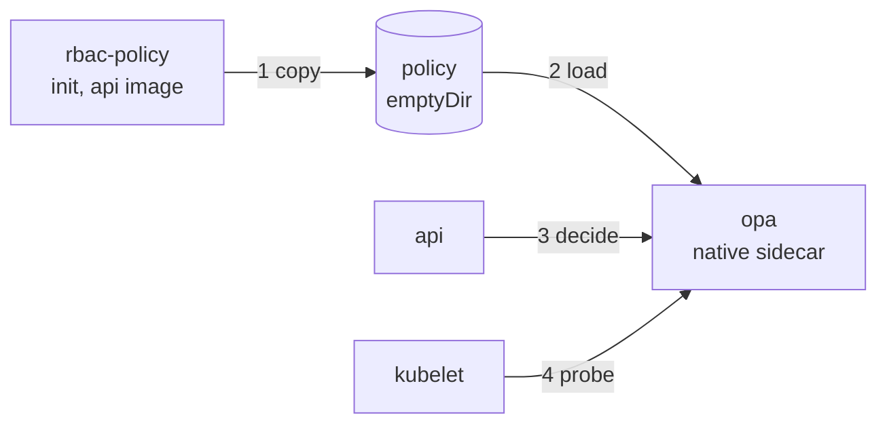

# Aggregator RBAC: OPA sidecar

Runs the aggregator's RBAC policy engine (OPA) next to every `aggregator-api`
pod. Off by default; one value, `aggregator-api.rbac.mode`, turns it on per
environment.

| Item | Value |
|---|---|
| App side | aggregator-dpg `feat/805-rbac` (#849); design `docs/rbac/rbac-design-aggregator.md` |
| Switch | `aggregator-api.rbac.mode`: `off` (default) / `log` / `enforce` |
| OPA image | `openpolicyagent/opa:1.21.1`, digest-pinned |
| Needs | An api image that ships `/app/policy/rbac/rbac.rego` |

## Pod layout

| Step | What happens |
|---|---|
| 1 | An init container from the api image copies `rbac.rego` into a shared volume |
| 2 | OPA starts as a native sidecar (`restartPolicy: Always`) and loads it; the api starts only after OPA's startup probe passes |
| 3 | The api asks `http://localhost:8181/v1/data/rbac/{decision,capabilities}` |
| 4 | Probes use a separate diagnostic port (`8282`, health and metrics only) |

## Decisions

| Decision | Why |
|---|---|
| Policy comes from the api image, not this repo or a fetch | The policy and the api's TypeScript mirror always match the running build |
| Decision port bound to `127.0.0.1` | Nothing outside the pod can query OPA or change its policy |
| OPA `--authorization=basic` with a chart-owned `system.authz` policy | Only `POST` to the two rbac paths is allowed, even from inside the pod |
| `--disable-telemetry` | OPA reports its version to an external service by default |
| No sidecar while `mode` is `off` | No cost and no behaviour change until an environment opts in |
| Optional `rbac.yaml` override from values | The coordinator export setting (design open item 1) can differ per instance without rebuilding |
| Sidecar resources in `global-resources.yaml` | Same place as every other request and limit |

## Steps

| Step | Where | Status |
|---|---|---|
| A1 Ship `policy/rbac/rbac.rego` in the api image | aggregator-dpg `apps/api/Dockerfile` | Done |
| B1 `rbac` values (mode, OPA image, timeouts, config override) | `charts/api/values.yaml`, `opentofu/aws/template/global-values.yaml` | Done |
| B2 `RBAC_MODE`, `OPA_*` env | `charts/api/templates/configmap.yaml` | Done |
| B3 Init container, OPA sidecar, volumes | `charts/api/templates/deployment.yaml` | Done |
| B4 `system.authz` policy and optional `rbac.yaml` ConfigMap | `charts/api/templates/` | Done |
| B5 Sidecar resources | `helm/global-resources.yaml` | Done |
| B6 Render checks for `off`, `log`, `enforce`; run the rendered OPA command and authz policy in Docker | local, CI `helm lint` / `template` | Done; `off` renders the same pod spec as before |
| B7 Docs | `helm/CLAUDE.md`, `helm/aggregator/README.md` | Done |

## Rollout per environment

1. Deploy an api image that contains the policy (A1).
2. Set `rbac.mode: log`, deploy, and check the api logs for `rbac.decision` denies.
3. Settle open item 1 (coordinator export) with the `rbac.yaml` override if needed.
4. Set `rbac.mode: enforce` and deploy.

Back out by setting `mode: off`; the sidecar is removed on the next deploy.

## Not in this change

| Item | Where it is tracked |
|---|---|
| Portal gate for org owners and admin-only attributes in the deployment realm (H-11) | aggregator-dpg RBAC plan, bluedots-automation row |
| Mirroring the OPA image to GHCR | Only if Docker Hub pulls are rate-limited |
| OPA in the worker | Deferred in the RBAC plan (worker re-check) |
